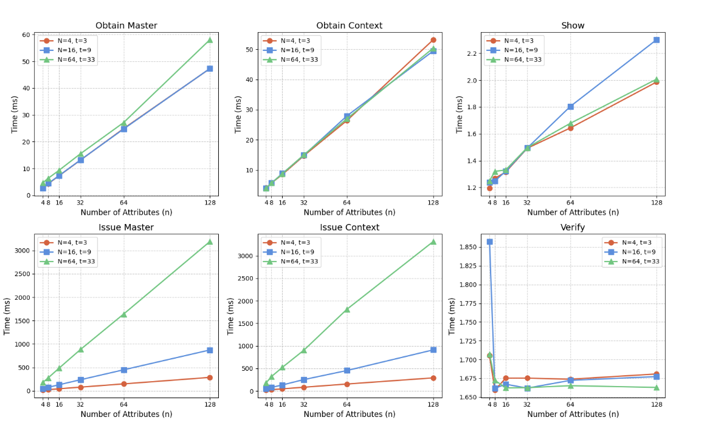

# T-SIRIS

I built a Threshold-Issued, Sybil-Resistant Privacy Preserving Identity System from Anonymous Credentials and Nullifiers for a paper I'm writing. It's currently part of my Thesis but will be a paper at some point. I started my Thesis reading the [CanDID paper](https://eprint.iacr.org/2020/934.pdf) 100s of times to understand what was going on as I didn't have a background in crypto (it literally has every crypto primitive there is!). In their future work section they suggest improving the privacy properties in their system by implementing Anonymous Credentials on top of their system, specifically [Coconut](https://www.ndss-symposium.org/wp-content/uploads/2019/02/ndss2019_06A-1_Sonnino_paper.pdf). As it suggests, a simple replacement of construction will not work and fiddly bits are needed, especially Sigma protocols to glue everything together in efficient ZK. In-fact, many of the same protocols are seen in [z-cash](http://zerocash-project.org/paper) and [UTT](https://eprint.iacr.org/2022/452.pdf) as their requirements are very similar.

For Sybil Resistance, I created a [nullifier scheme](https://github.com/sampolgar/nullifiers) similar in thought to z-cash and using the Dodis-Yampolskiy VRF flavor from UTT but mine is faster as shown in the link and soon to be paper.

## Technical Implementation

The threshold construction is based on an updated version of Coconut as described in [UTT](https://eprint.iacr.org/2022/452) and Nym's [2022 security analysis](https://eprint.iacr.org/2022/011.pdf). The performance comparison between our implementation and Nym's is shown below:

| Operation         | System  | 4 Attributes | 16 Attributes |
| ----------------- | ------- | ------------ | ------------- |
| Credential Show   | Nym     | 15ms         | ~40ms         |
| Credential Show   | T-SIRIS | 15ms         | 1.35ms        |
| Credential Show   | tACT    | 7.90ms       | 15.78ms       |
| Credential Verify | Nym     | 12.5ms       | ~35ms         |
| Credential Verify | T-SIRIS | 1.71         | 1.82ms        |
| Credential Verify | tACT    | 11.20        | 26.64ms       |

\_Note: Nym is approximate, scaled based off data in [Nym paper](https://eprint.iacr.org/2022/011.pdf)

## Why did you build this?

I created a comparison between the state of the art papers trying to do what CanDID does, the biggest competitor was the [Threshold Anonymous Counting Tokens](https://eprint.iacr.org/2024/1024) and their system S3ID so I decided to compare the other constructions I found too. I found S3ID to be slower for Show/Verify but faster for issuing than ours.

## Results

### The Threshold-Issued Construction Itself

Our construction achieves substantial speedups over tACT, with up to 44× faster verification and nearly constant-time Show/Verify regardless of attribute or node count, thanks to optimized MSM and Schnorr ZKPs. While tACT is faster for signature share generation due to skipping ZK checks, our approach excels in all other operations and scales efficiently, making it ideal for systems prioritizing frequent credential verification.

### Identity System

